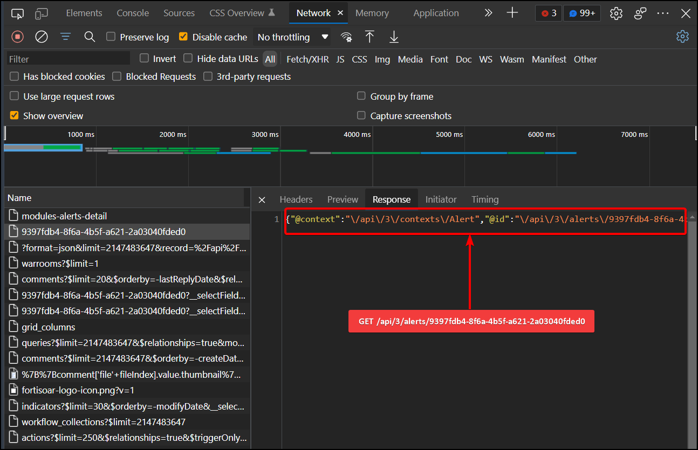
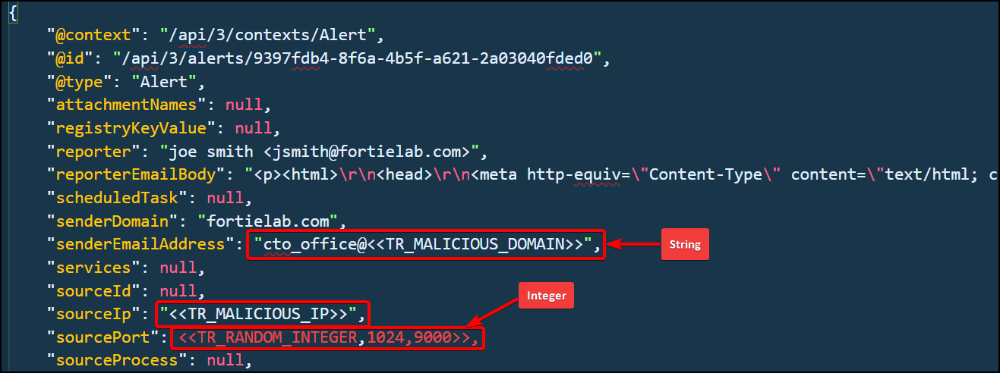

# FortiSOAR SOC Simulator 

The FortiSOAR SOC Simulator connector is used to run Use Case simulations. a Use case simulation (Scenario) has the below design principles:

- A simulation starts with a record (Typically an alert) having the same data the record has when it is created via the ingestion process. This will guarantee all subsequent workflow would work the same regardless whether the source of the record is a simulation or a live environment data
- Optionally, It should be possible to run a simulation in either automated way, so all playbooks will be trigger automatically or a manual way where the user has to use the WebUI to trigger them. To achieve this a simple method below could be used:
  - All actual playbooks should be created with a referenced trigger
  - Each actual playbook would have two parent playbooks, one with a manual trigger and anotherone automated (onCreate/onUpdate)
  - A simulation can use a record attribute (such as: SOURCE TYPE in Alerts) value to decide whether subsequent playbooks will run automatically or not (manually triggered then)
- The simulation should always indicate via the Workspace comments what is the **next step** to guide users running the simulation in the workflow
- Try to always to leverage existing solution pack to accomplish tasks, if a bug is detected, it can be reported in the issues section of the corresponding solution pack

To configure this connector, open the FortiSOAR SOC Simulator Connector and in its "Configuration > Page" enter the following values for the configuration parameters   

- **Configuration Name**: Provide a name for this configuration and you can optionally mark this configuration as the “Default Configuration”.  

- **Import Scenarios**: Select this checkbox to import various scenarios.  

- **Load Threat Intelligence**: Whenever records are recreated for a scenario, they include known malicious indicators, such as IP addresses, file hash, etc. Selecting this checkbox randomly assigns the malicious indicators to records every time a record is created. Therefore, the records get created with new indicators each time.   

  

Once you have configured the FortiSOAR SOC Simulator connector, sample scenarios get created in Help > Scenario and now, you are all set to start using the content pack and creating demo records.  

  

### Contributing Scenario 

  

First you will have to fork git repo https://github.com/fortinet-fortisoar/connector-fortisoar-soc-simulator. Here you will create a folder, aptly named as per your usecase,  under 'scenarios' folder. 

The folder that you will create should contain two files 

> **scenario_record.json** 

   This file is scenario record 

> **scenarion_configuration.json** 

   This file is configuration export for a scenario 

Lets discuss process in brief 

- ##### Design 

   - Design your scenario of ForiSOAR instance. Here you will create demo records , module , system view changes along with required playbooks. Apart from this , we need to create a 'Scenario Record'. This record will be launch point for scenario. Please check 'Scenario Record' section to see how to a create a Scenario Record. 

- ##### Exporting Scenario 

   - You can export secenario by selecting scneario record and execute playbook  - *Export  Scenario* 

- ##### Exporting Scenario Configuration 

   - You can export required configuration for a scenario using 'Configuration Export' option listed under 'Application Editor' 

      - Here you export required module schema along with system view template, playbook collection , connector , users / team ,etc  

  

#### Creating Scenario Record

 A scenario record contains Title, Description and steps

There are two ways to create a scenario record steps.

- Record which refer playbook to create a scenario demo record 

- Record which has demo record JSON playload. This method also allows user to add a placeholder for some values which can be replaced dynamically  

  
##### Scenario record referring playbook for creation of demo record  
  

While creating scenario add following in 'steps section' . Replace values at appropriate location  

 

{ 

  "Steps": [ 

    { 

      "name": "<<Name of Scenario>>", 

      "type": "createAlert",    << -- this tells we want to create demo record using alert record JSON and not playbook 

      "alertFields": { 

        <<<Alert Record JSON>>> 

      }, 

      "preCreateMessage": "<<Message you want to display before creation of demo record>>", 

      "postCreateMessage": "none", 

      "waitTimeforNextStep": "<<time in seconds to delay next step>>" 

    } 

  ] 

} 

 

    

> Complete Example 

    

 

{ 

  "Steps": [ 

    { 

      "name": "Repeated Login Failures", 

      "type": "createAlert", 

      "alertFields": { 

        "name": "Repeated Login Failures on 192.168.60.172", 

        "type": "Brute Force Attempts", 

        "state": "/api/3/picklists/a1bac09b-1441-45aa-ad1b-c88744e48e72", 

        "source": "Syslog", 

        "status": "Open", 

        "severity": "low", 

        "sourceIp": "<<TR_MALICIOUS_IP>>", 

        "sourceType": "linux_secure", 

        "sourcedata": "{\"host\":\"marketing.server.1\",\"rhost\":\"43.225.46.25\",\"pid\":\"5654\",\"_confstr\":\"source::/var/log/secure|host::ip-10-1-3-106|linux_secure\",\"date_zone\":\"local\",\"_eventtype_color\":\"\",\"_indextime\":\"1500279602\",\"euid\":\"0\",\"timeendpos\":\"16\",\"date_hour\":\"8\",\"source\":\"/var/log/secure\",\"process\":\"sshd\",\"date_wday\":\"monday\",\"_serial\":\"8\",\"_kv\":\"1\",\"punct\":\"__::_----_[]:_(:):__;_=_=_=_=_=_=...__=\",\"_sourcetype\":\"linux_secure\",\"_raw\":\"Jul 17 08:20:02 192.168.60.172 sshd[5654]: pam_unix(sshd:auth): authentication failure; logname= uid=0 euid=0 tty=ssh ruser= rhost=43.225.46.25 user=root\",\"_si\":[\"10.1.3.32\",\"main\"],\"securonix_server\":\"10.1.3.32\",\"sourcetype\":\"linux_secure\",\"date_month\":\"july\",\"index\":\"main\",\"timestartpos\":\"0\",\"eventtype\":\"\",\"user\":\"root\",\"date_mday\":\"17\",\"linecount\":\"\",\"tty\":\"ssh\",\"event_id\":\"3F3CBAA2-CB55-4976-95EA-3627677F1EE3@@main@@00f9a277c2dce41ac744d522c35f8ccb\",\"uid\":\"0\",\"_time\":\"1500279602\",\"date_minute\":\"20\",\"date_year\":\"2017\",\"date_second\":\"2\"}", 

        "description": "
Suspicious Login Failures on asset marketing.server.1 from 43.225.46.25&nbsp;
", 

        "targetAsset": "marketing.server.1", 

        "destinationIp": "192.168.60.172", 

        "killChainPhase": "Reconnaissance", 

        "destinationPort": "443" 

      }, 

      "preCreateMessage": "Create Repeated Login Failure Alert", 

      "postCreateMessage": "none", 

      "waitTimeforNextStep": "5" 

    } 

  ] 

} 

 

Here "sourceIp": "<<TR_MALICIOUS_IP>>"   << this is an example set a placeholder (variable) where you want to change value of , here, sourceIP dynamically when demo record is created. The supported variables are:

|"VARIABLE"|function name|use case|
|:----------|:-------------|:-------------|
|"TR_MALICIOUS_IP"|get_malicious_ip| Gets a malicious IP from CTI|
|"TR_MALICIOUS_DOMAIN"|get_malicious_domains| Gets a malicious domain name from CTI|
|"TR_MALICIOUS_URL"|get_malicious_url|Gets a malicious url from CTI|
|"TR_MALICIOUS_HASH"|get_malware_hash|Gets a malicious hash from CTI|
|"TR_RANDOM_INTEGER"|get_random_integer|Gets a random number between 55555 and 99999 if used without parameters, if MIN, MAX parameters are specified (exp: <<TR_RANDOM_INTEGER,1,100>>) the variable returns an integer from 1 to 100 |
|"TR_PUBLIC_IP"|tr_get_my_public_ip|Returns the public IP address of FortiSOAR |
|"TR_USERNAME"|tr_get_username| Returns a random username of a famous person |
|"TR_ASSET_IP"|get_asset_ip| get a random local IP from the prefix: 10.200.3.2-25, to specify another range (30 to 99 for example) use the syntax: <<TR_ASSET_IP,30,99>>|
|"TR_FORMATTED_TIME"|tr_get_formatted_time|get time (with the format `ddd, DD MMM YYYY HH:mm:ss Z`) if used without parameter, the variable can take a parameter: X_MINUTES_AGO, so if you use <<TR_FORMATTED_TIME,120>> in your alert definition the connector will resolve it to the formatted time of two hours ago (120 min) |
|"TR_TIMESTAMP"|tr_get_timestamp|get current timestamp if used without parameter, the variable can take a parameter: X_MINUTES_AGO, so if you use <<TR_TIMESTAMP,120>> in your alert definition the connector will resolve it to the timestamp of two hours ago (120 min) |

##### Scenario record referring alert Playbook 

While creating scenario add following in 'steps' section  . Replace values at appropriate location  

 

{ 

  "Steps": [ 

    { 

      "name": "<<Name of Scenario>>", 

      "type": "executePlaybook",  << -- this tells we want to create demo record invoking a  playbook and  not alert record JSON 

      "playbookIRI": "/api/3/workflows/<<GUID>>",  << -- IRI of playbook   

      "preCreateMessage": "<<Message you want to display before creation of demo record>>", 

      "postCreateMessage": "<<Message you want to display after creation of demo record>>", 

      "waitTimeforNextStep": "<<time in seconds to delay next step>>" 

    } 

  ] 

} 

 

  

>Complete Example 

 

{ 

  "Steps": [ 

    { 

      "name": "Concurrent Successful Authentications", 

      "type": "executePlaybook", 

      "playbookIRI": "/api/3/workflows/37603f90-ab2c-42a0-b183-50e92fdd2fd1", 

      "preCreateMessage": "Creating demo record for Concurrent Successful Authentications", 

      "postCreateMessage": "", 

      "waitTimeforNextStep": "5" 

    } 

  ] 

} 

 

In this case (executePlaybook) it is possible to use alert template with variables as explain below:

- Using your browser's Dev tools identify the JSON definition of an alert you would want to replay in the future

- Replace the relevant values with Variables from the list above as shown below

- In your scenario playbook create a new "Create Simulated Alert" action from the SOC Simulator connector and paste your JSON there. Each time the playbook runs it will create an alert with the input JSON you specified after resolving the variables.

> Check the sample playbooks provided by the connector

Refer for more details about content pack: https://fusecommunity.fortinet.com/viewdocument/incident-response-content-pack?CommunityKey=9f1420e8-e3c6-4535-8cae-3fa714da66d8&tab=librarydocuments